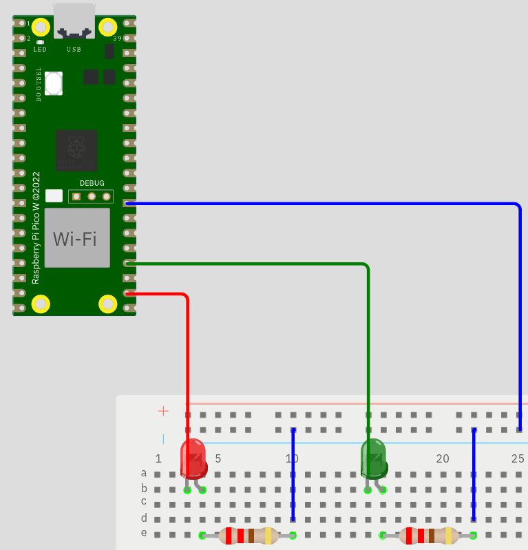
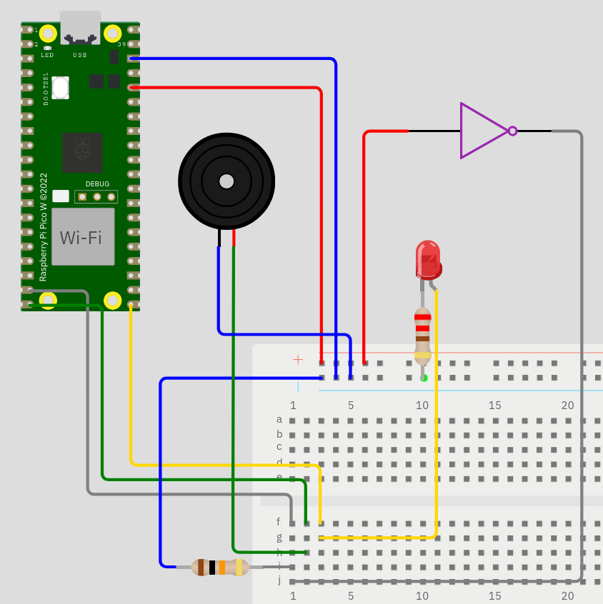

# Information transmitter

## Student credentials

Serhii Kasparov (sk224rh)

## Description

This project was created to transmit information through light. The project consists of two parts: a server and a listener. The server can have many listeners (in this case, only one, since I don't have many Raspberry Pi devices). Listeners work according to the MQTT protocol, namely, a user can subscribe listeners to a topic, and they will receive messages sent to that topic. I've spent in total more than 100 hours on that project (mainly because I needed to learn a lot of new stuff, for example nodejs, it was not so hard but it took a lot of time).

## Objective

With this devices - we can transmit data in places where no radio connection (Wifi, LTE, LoRa) is possible. So far, we only have an LED and a photoresistor, but this can easily be upgraded to a laser, which will enable information to be transmitted over longer distances. We can even use it in the space (but then again, we need laser). I chose this project because it is interesting to write your own encapsulation and decapsulation protocol as well as own MQTT broker. 

## List of material

| Name | Description | Cost | Source |
| ---- | ----------- | ---- | ------ |
| Red LEDs | In my project red LEDs are used to send information or display numbers (to display number 3 we can do 3 blinks). Red LED is used for sending information because it is the brightest one | 5 SEK | [electrokit](https://www.electrokit.com/en/LED-5mm-rod-diffus-1500mcd) |
| Green LED | In my project green LED is used to display connection status (it turns green when device is transmitting information) | 5 SEK | [electrokit](https://www.electrokit.com/en/LED-5mm-gron-diffus-80mcd) |
| Photo resistor | Photo resistor lower its resistance when contacting with light. With help of this sensor in my project devices can receive information from LEDs (using long and short blinks as 1 and 0) | 9.50 SEK | [electrokit](https://www.electrokit.com/en/fotomotstand-cds-4-7-kohm) |
| 330 Ω resistors | This resistors are needed in my project to make the LEDs work well (LEDs will just burn without resistors, and higher resistors will make lack of voltage for LEDs) | 1 SEK | [electrokit](https://www.electrokit.com/en/motstand-kolfilm-0.25w-330ohm-330r) |
| 10 kΩ resistor | This resistor is needed in my project to pull down all voltage fluctuations (because there can be a light from other sources except LED) | 1 SEK | [electrokit](https://www.electrokit.com/en/motstand-kolfilm-0.25w-1kohm-1k) |
| Passive buzzer | In my project this buzzer can play melody (audiofiles). I picked passive buzzer, because active buzzer can not change frequency (so it is impossible to play notes) | 29 SEK | [electrokit](https://www.electrokit.com/en/piezohogtalare-passiv) |
| Raspberry Pi Pico WH | In my project this rpi is receiver, it is responsible for taking information using photo resistor and do different action, depending on type of information | 99 SEK | [electrokit](https://www.electrokit.com/en/raspberry-pi-pico-wh) |
| Raspberry Pi 5 | In my project this rpi is database, server and sender. You can replace it by computer and second rpi pico wh | 1599 SEK | [electrokit](https://www.electrokit.com/en/raspberry-pi-5-16gb) |

P.S. In the table I showed cost of only one unit. So 3 LEDs will cost 15 SEK.

## Computer setup

As code editor I used [neovim](https://neovim.io), and as a database command interface I used [pgcli](https://www.pgcli.com). I also used [micropython](https://micropython.org) to upload the code to the rpi pico. To setup computer (in my case raspberry pi 5) - you need to install [nodejs](https://nodejs.org/en), then [express framework](https://expressjs.com) and [pg-promise](https://www.npmjs.com/package/pg-promise). Also you need to setup [postgresql](https://www.postgresql.org) . For sender part - you need to install [gpiozero](https://pypi.org/project/gpiozero) python library. I used [void linux](https://voidlinux.org) , and I had some troubles with installing libraries, but if you're using provided by creators [Raspberry Pi OS](https://www.raspberrypi.com/software/operating-systems), then it will be preinstalled on your device. Code is uploaded on [github](https://github.com)  using git.

## Putting everything together

### Sender

Sender is sending information when receives it from the web (so this rpi must have wifi module).

Red LED is information LED. Sender sends information through it. When blink of led is short (in my code is 0.1 s) - it means zero, when blink is long (in my code is 0.3 s) - it means one. As we know, my zero and ones we can express any information. The red LED is connected to the GPIO pin 17. So `red LED's anode -> GP17, red LED's cathode -> 220 Ω resistor -> GND`.

Green LED is status led (it turns on when sender is sending information). It is connected to the GPIO pin 18. So `green LED's anode -> GP18, green LED's cathode -> 220 Ω resistor -> GND`.

### Receiver

Receiver is receiving information from sender's information LED. It is important that there must not be other light except information led, because in that light from other sources will interfere light from information led, and it will damage integrity of transmitting information. To prevent this - I am using the black long cylinder, in which place information led and photo resistor. But this way of protection has one flaw - distance. Sender and receiver must be near each other, but instead of cylinder you can be in the dark room, and distance between devices can be couple of meters.

Photo resistor (purple triangle) is main component of receiver. With help of this resistor it can receive information from sender's information led. Photo resistor lowers its resistance if receives a light. So it is important that no other light except information led will go in it. Resistor is connected to the GPIO pin 14, it is important to know that it is also connected to the GND through the 10 kΩ resistor. This resistor is needed for pulling down voltage fluctuations from photo resistor (because some other light than information LED's light can get into photo resistor), 10 kΩ is an optimal choice because less amount of Ω will allow some other lights to go threw "protection", while more Ω can deny even light which is needed (light from information LED). Because both contacts of photo resistors are same - it is doesn't matter which you will pick first and which second. So `first photo resistor's contact -> 3V3, second photo resistor's contact -> GP14, second photo resistor's contact -> 10 kΩ resistor -> GND`.

Buzzer is needed for playing melody if information was audio. It plays it using notes, which described as a dictionary: each node corresponds appropriate frequency. I picked passive buzzer, because it is impossible to set frequency in the active buzzer. Because passive buzzer has only two options: frequency and volume - it is very hard to play complex melodies or reproduce human voice, so in my project it can plays only simple melodies. If you want to write your own melody - you must write letter (which represents note), then symbol `-`, and then amount of milliseconds which this note will stay (duration). If you want to do a pause - write symbol `_`. Separation symbol between note and duration pairs is `|`. So here is example of beginning of song named [megalovania](https://www.youtube.com/watch?v=KK3KXAECte4): `C-100|C-100|B-100|_-50|A-100|_-50|_-50|G#-100|_-50|G-100|_-50|F-200|D-100|F-100|G-100`. Buzzer is connected to the GPIO pin 15. So `buzzer's power pin -> 3V3, buzzer's ground (negative) pin -> GND, buzzer's signal pin -> GP16`.

Number LED is responsible for showing information if it is a number. It blinks amount of times equal to the sent number. This LED is connected to the GPIO pin 16, so `number LED's anode -> GP16, number LED's cathode -> 220 Ω resistor -> GND`.

P.S. If you want to use it in production - you need to think about frame. It can't be just on the breadboard, because receiver will possibly be on the mountains and in space, so weather will damage the system without appropriate, also you probably will want better buzzer to transmit voice and complex melodies (such as songs or orchestral chorus). LEDs and resistors are ready for production, but probably it will be a good idea to make them smaller. Also you need to replace information LED by laser for distances longer than couple of meters, also environment will have other light sources than information LED).

## Platform

I chose to do a local hosting, so all data serves on my device. To make it globally accessible - I am using [cloudflared tunnel](https://github.com/cloudflare/cloudflared). As a server I am using [nodejs](https://nodejs.org/en) and as a database I am using [postgresql](https://www.postgresql.org). I created my own data visualisation tool, as well as data transmitting program. I choose that way of serving data because it requires much more skill and knowledge, so I will understand how works every component of my project. Also for me it is much more interesting. By the way, I don't need any subscritption to do it (I hate when somebody must pay for software), every software is completely free, because nodejs and postgresql provide basic functionality, while other functionality I created and implemented by myself.

## The code

### Python

There are several files of code (for different levels). We will begin from lower level to higher. Lowest level file called [bit.py](./py/bit.py). This file has a all functions needed for data type conversion (for example decimal integer to binary integer, text to integer, audio to text, etc), also it has functions for sending and receiving information via LED and photo resistor.

Next file is [dencode.py](./py/dencode.py), it is responsible for encoding and decoding data (encoding to binary code, and also decoding from binary code). It uses [bit.py](./py/bit.py) for converting some data types.

Also there is [sound.py](./py/sound.py), it has list of notes, each note corresponds to number, which represents frequency with help of witch buzzer can play appropriate note. Also it has a function, which plays melody from list of notes and duration of this notes.

Next file is [nw.py](./py/nw.py), which has functions to connect raspberry pi to the wifi.

Code of receiver stores in [receiver.py](./py/receiver.py), it waits for first light entry (with help of `receive()` function in [bit.py](./py/bit.py)), and then writes it to the list of ones and zeroes,then it decodes it and do appropriate action, depending on type of information it can play melody, show number by number led and write text to the file.

Code of sender stores in [sender.py](./py/sender.py). It sends information which it receives from server. This code using `urequests` library to take data from server.

### Nodejs

The main file of server is [nd.js](./js/nd.js) . It stores all routes and links method to pages. Also you can find all html files in [public](./js/public) directory. It has several functions, such as creation of topic, assigning RPis to topic and sending message of different types to topics. Now three types are available: number, text and audio.

## Transmitting the data / connectivity

I saw a lot of mqtt brokers, but instead of using an existing one I decided to create my own. I tried to simulate mqtt protocol using https, so it is not 100% mqtt broker. It has functionality to create topics, assigning RPis to topics, sending messages to topics, but it is using http protocol (as you can see upper it uses nodejs), so we can not say that this is mqtt broker. But I can send messages, receive information and so on, completely like I do it in mqtt broker. To transmit the data via http I am using wifi. Every RPi (which listens to the topic) sends post request to get new information from the topic each second, so if somebody will post a message to the topic - it will be read in one second by every RPi. So the data is sent as often as user sends a message (except checking for new information by RPis every second) . Usage of wifi and checking for new information every second consumes a lot of power, but the point is that sender is connected to power supply, so it should not be a problem, while receiver will be on the long distance, but it just wait information from photo resistor, so receiver don't use much power. I choose to write everything by my own because it is more interesting, also I choose to use http protocol because it gives me a possibilities to write a lot of things by myself.

## Presenting the data

Because I created the dashboard program - it looks simple. All that it shows - amount of messages which was sent in every topic and amount of subscriptions in every topic, which has more than zero subscription.

The data is saved in database as often as user sends a message, creates a new topic or assings RPi to an existing topic. I choose the [postgresql](https://www.postgresql.org), because it has more functions than other databases (for example cycles) and it is more robust. When changing the data about the topics (creating new messages) - I just increment AMOUNT variable, so there is no need to store every message.

## Finalizing the design

First user must go to the page on link, generated by [cloudflared tunnel](https://github.com/cloudflare/cloudflared). Then user need to send a message on topic. Because it is hard to write an audio - it is already preset in interface. Every RPi (sender), which is subscribed to that topic will send this information using information led, and then receiver will receive it. User can subscribe all available RPi (sender) to any topic, but only one at time (one sender can be subscribed to only one topic, while topic can have a multiple sender). Here is example of sending number, text and audio. It takes a long time to transmit data, so some parts of videos will be sped up.

### Topic creation

Here I created topic `/test/test`. As you can see, after creation it appeared on the dashboard.

### Assign RPi

I chose to assign `RPi 5` model, but if you want to initialize new - you must do post query to `/init` link (after site link) with `{ model: YOURMODEL }` headers.

### Send number

I sent number `50` on the `/test/test` topic, and number led blinked 50 times.

### Send text

I sent `Quod erat demonstrandum` message to `/test/test` topic, and receiver wrote it to the `texts.txt` file. I showed this file to you with help of [ampy](https://learn.adafruit.com/micropython-basics-load-files-and-run-code/install-ampy) program.

### Send audio

I sent melody with name `megalovania` to the `/test/test` topic. As you can see - it was only one choice. Melody is preset because it is hard to write your own melody.
