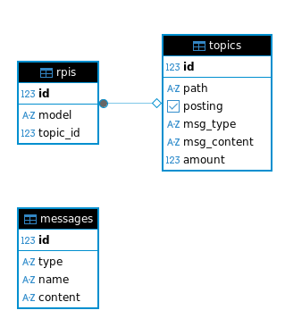
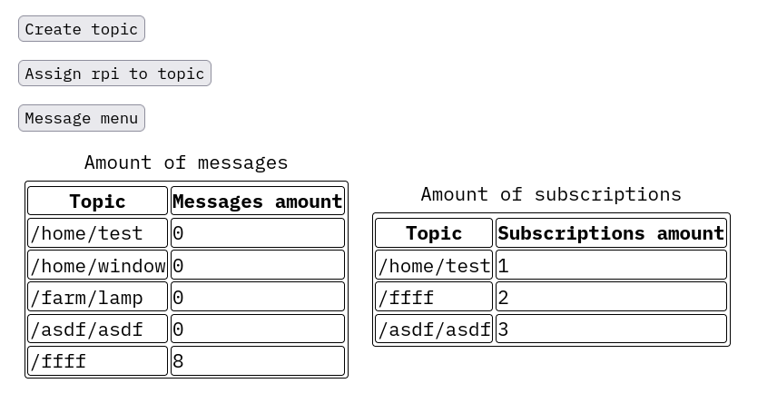
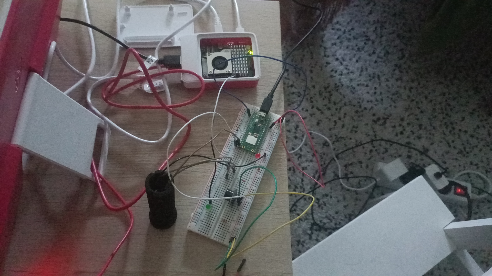
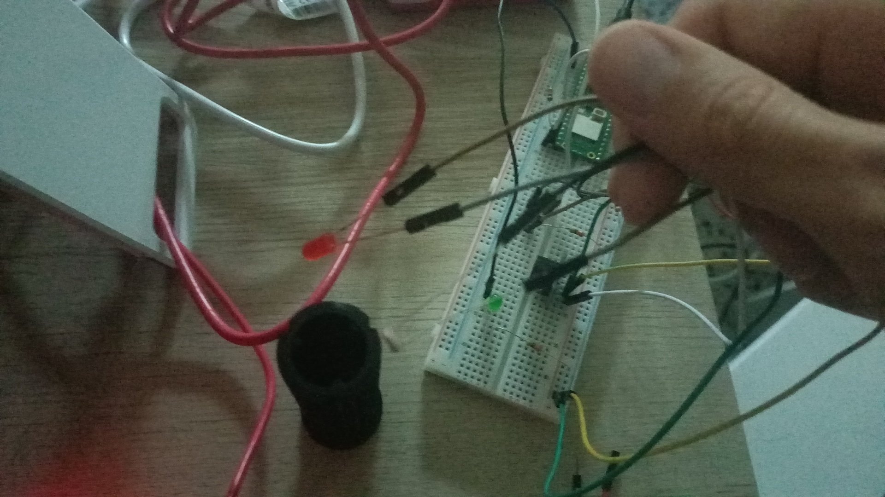

# Project report

This project was created to transmit information through light. So far, we only have an LED and a photoresistor, but this can easily be upgraded to a laser, which will enable information to be transmitted over longer distances. The project consists of two parts: a server and a listener. The server can have many listeners (in this case, only one, since I don't have many Raspberry Pi devices). Listeners work according to the MQTT protocol, namely, a user can subscribe listeners to a topic, and they will receive messages sent to that topic. With this devices - we can transmit data in places where no radio connection (Wifi, LTE, LoRa) is possible. We can even use it in the space (but then again, we need laser). I chose this project because it is interesting to write your own encapsulation and decapsulation protocol as well as own MQTT broker. I've spent in total more than 100 hours on that project (mainly because I needed to learn a lot of new stuff, for example nodejs, it was not so hard but it took a lot of time).

## Process of creation

I love terminal, so everything was done with [neovim](https://github.com/neovim/neovim) and [pgcli](https://www.pgcli.com). I used micropython to program the rpi pico and lgpio library to program rpi 5. Rpi 5 runs an one python program, which rpi pico w can run as well, so I use only microcontroller functions. Also rpi 5 runs the server and database, but any computer can run it, so we can just split these two functions and imagine that they're running on different devices. I learned how to work with [nodejs](https://nodejs.org/en) (with [express](https://expressjs.com) framework). As database I used [postgresql](https://www.postgresql.org) (because it has more functions and it is more robust). All encoding algorithms and interaction scripts was written by me. Here is they:

* [bit.py](./py/bit.py) - responsible for convert data from one type to another [dencode.py](./py/dencode.py) - responsible for encoding and decoding
* [nw.py](./py/nw.py) - network connection
* [nd.js](./js/nd.js) - main server file

## Server side

The server part, in turn, consists of a database that stores models, topics, and some messages, as well as a server written in nodejs.

### Database

The database contains three tables: rpis, topics, and messages. As you can see, the messages table is not related to the topics table, as it simply serves as a repository for certain messages, but not all of them (for example, audio files, which are difficult to create).

### Server

On the server's main page, you can view statistics, create a new topic, subscribe a listener to a topic, and send messages to a topic. All of the above entries are saved in the database. Currently, you can send three types of messages: number, text, and audio. The front end also features input validation. To initialize new raspberry pi model, you need to do a post request from it to the server, with `{ model: yourModel }` key-value pair. Data transmitted as often as user sends messages. All RPis are checking for new messages every second.

## Listener

The listener consists of two Raspberry Pi devices. One of them (sender) receives information from the server using wifi, encodes it, and transmits it in the form of light signals to the other. The other Raspberry Pi receives the information and, depending on its type, performs certain actions, for example: when it receives a number, it makes the LED flash the corresponding number of times; when it receives text, it writes it to a file in its system (which can be read later); and when it receives an audio file, it plays it.

In general all project looks like that:

## Important infomration

### Student credentials

Serhii Kasparov (sk224rh)

### Bill of materials

* Raspberry Pi 5 (but can be any other rpi, such a pico)
* Raspberry Pi Pico W
* Resistors
* Jumper wires
* Bredboard
* Leds
* Photoresistor
* 3D Printed cilinder for light isolation
* Buzzer

### Construction

We have to rpis: one with led, photoresistor and buzzer, other with two leds.

Sender has two leds. When sender receives information, it encodes it to ones and zeroes, and sends it using sending led (short blink is zero, long blink is one). When it sends information - it turns on other led, in order to display sending status (we will call it status led).

Receiver has 3 components: photoresistor, led and buzzer. It recives information using light-sensible photoresistor (you can see all timings and principles by watching the code in the [bit.py](./py/bit.py) file). If information is number, it blinks the led (we will call it number led) times equal to that number. If information is audio, it plays it using buzzer, if inofmration is text - it writes it to the file in filesystem (which later we can read).

Also I used black cylinder to put photoresistor and sending led, in order to prevent other light. Later there will be no need at it, because a laser can be used.

### Platform

My platform is local device, but I use [cloudflared](https://github.com/cloudflare/cloudflared) to make it global accessible. Cloudflared is just a tunnel, which redirects all requests to my local machine, so it is not a cloud. I chose that because I want to do all by myself, not to use ready solutions.

### How the project looks?

Because I have only one bredboard and to rpis, I placed components of both onto one bredboard. But it is possible to divide them, and if room is dark - we can have distanse of couple of meters between them. Green led is status led, red led is number led. Sending led and photoresistor are hidden into black cylinder.

